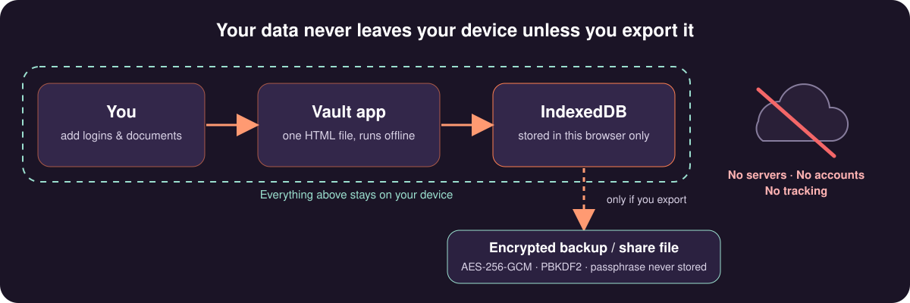

# Vault — Personal & Business Credential Manager

A private, local-first PWA for keeping logins, subscriptions, and important
documents organized — cleanly split between Personal and Business, and
installable straight to your home screen or desktop. A [LAZLAB Creations](https://johnlaz.github.io/) app.

## Live

| | URL |
|---|---|
| Landing page | https://johnlaz.github.io/vault/ |
| App | https://johnlaz.github.io/vault/app/ |

## Features

- **Personal / Business split** — separate spaces for two sides of life, one app
- **Credentials & subscriptions** — logins, billing info, notes, quick reveal/copy
- **Document vault** — attach PDFs and images (IDs, licenses, contracts, policies)
- **Selective sharing** — export just the items you pick into a portable file; importing merges them in without touching or overwriting anything already there
- **Encrypted exports** — optional passphrase protection on backups and shares (AES-256-GCM, PBKDF2)
- **Excel import** — bring in existing passwords from a spreadsheet (needs a connection the first time you use it)
- **Installable PWA** — launches offline, add to home screen on iOS, Android, or desktop
- **No accounts, no servers** — everything lives in your browser's local database

## Install

Open the live app and use your browser's "Add to Home Screen" (iOS/Android) or
the install icon in the address bar (Chrome/Edge desktop). Once installed it
launches full-screen like a native app and keeps working offline.

## Data & privacy

All data stays on your device unless you explicitly export it. Exports can be
encrypted with a passphrase you choose at export time — that passphrase is
never stored anywhere, so keep it somewhere safe; there's no recovery if it's
lost. The vault on this device is not encrypted at rest, so it is only as safe as
the device and browser profile — treat device access accordingly. Settings shows
whether your browser has agreed to protect Vault's storage from automatic clearing;
export backups regularly regardless.

## AI / model setup

None. Vault makes no AI calls and needs no API keys.

## Tech

Single HTML app file. Tailwind (precompiled to `app/tailwind.css`), Dexie.js over
IndexedDB for storage, Web Crypto for export encryption. Everything needed to
start is bundled and precached, so it launches offline. The optional Excel import
loads its library on demand and needs a connection. No backend, no tracking.

## Repo layout

| Path | Purpose |
|---|---|
| `index.html` | Landing page |
| `README.md` | This file |
| `docs/` | README images (SVG) |
| `app/index.html` | The entire app |
| `app/tailwind.css` | Precompiled Tailwind styles |
| `app/dexie.min.js` | Dexie (IndexedDB), self-hosted |
| `app/dm-sans.woff2` / `app/playfair.woff2` | Self-hosted fonts |
| `app/manifest.json` | PWA install metadata |
| `app/service-worker.js` | Offline caching |
| `app/icon-192.png` / `app/icon-512.png` | App icons (512 is maskable-safe) |
| `app/apple-touch-icon.png` | iOS home screen icon |

## Deploy & update

Hosted on GitHub Pages from the repo root. To release a change:

1. Edit the files and commit to `main`.
2. Bump the version in **both** places so they match: `APP_VERSION` in `app/index.html` and `CACHE_VERSION` in `app/service-worker.js`.
3. If you add or remove a file the app needs at startup, update `CORE_ASSETS` in `app/service-worker.js`.
4. If you change Tailwind classes in `app/index.html`, rebuild `app/tailwind.css` with the Tailwind v3 CLI using the app's colour/font config.

Installed copies pick up the new service worker on the next online launch; the
Settings screen shows the running version.

## Changelog

- **v3** — Fully offline launch: Tailwind, Dexie and fonts are now self-hosted and precached. Service worker rewritten (network-first pages, cache-first assets). Version stamp and storage-protection status in Settings. Manifest `id`; single maskable 512 icon. Removed stray files.
- **v2** — Previous release (CDN-loaded styles and libraries).
